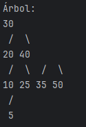

# Proyecto: Árbol AVL Examen Final de Estructura de Datos

## Descripción del Proyecto

Este proyecto implementa un Árbol AVL en Java, desarrollado como parte del examen final del curso de Estructura de Datos.  
El programa permite al usuario ingresar números enteros por consola. Luego de cada inserción, el árbol se equilibra automáticamente y se imprime su representación visual.

Este ejercicio muestra cómo funciona la estructura de un árbol AVL, incluyendo rotaciones simples y dobles, manteniendo siempre el equilibrio del árbol.

## Entradas

El usuario puede ingresar valores numéricos de uno en uno. Ejemplo de una serie de entradas:

Ingrese un número: 30  
Ingrese un número: 20  
Ingrese un número: 40  
Ingrese un número: 10  
Ingrese un número: 25  
Ingrese un número: 35  
Ingrese un número: 50  
Ingrese un número: 5  

## Salida

Después de cada inserción, el árbol AVL se imprime en consola. A continuación un ejemplo del resultado visual:

Árbol:  
30  
/ \  
20 40  
/ \ / \  
10 25 35 50  
/  
5  

## Ejemplo Gráfico del Árbol AVL

## Instrucciones para Ejecutar el Proyecto

1. Clona el repositorio:  
   git clone https://github.com/primoquan/Final_Estructura

2. Accede a la carpeta del proyecto:  
   cd Final_Estructura

3. Compila los archivos Java:  
   javac src/main/*.java

4. Ejecuta el programa:  
   java src.main.Main

5. Ingresa números enteros uno por uno. Escribe `-1` o `exit` para salir.

## Video Demostrativo

https://youtu.be/mbd0jL6r2NQ

---

**Autor:** Luis Miguel Quan  
**Curso:** Estructura de Datos  
**Docente:** Ingeniero Brandon Chitay  
**Año:** 2025
